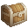
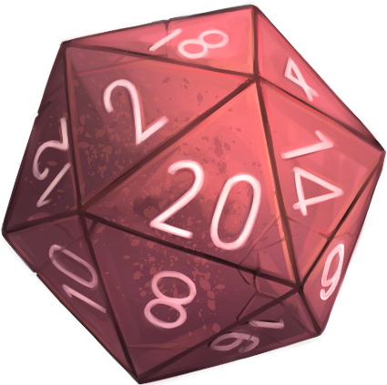
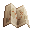

  
   
  <i>L'archivio delle tue cronache.</i>
    

Vellum è una companion app offline-first per campagne fantasy e giochi di ruolo tabletop (TTRPG). Progettata con un'estetica dark fantasy moderna ed elegante, Vellum è il compagno silenzioso che ti aiuta a tracciare la storia del tuo mondo senza distrazioni.

---

## 🔮 Caratteristiche Principali

###  1. Cronache (Dashboard)
- **Visualizzazione Ottimizzata**: Liste virtualizzate grazie all'uso di `CustomScrollView` e `SliverList` per performance elevate anche con centinaia di elementi.
- **Skeleton Loading**: Effetto shimmer premium (`DndShimmer`) durante il caricamento dei dati per ridurre la percezione dell'attesa.

###  2. Sapere (Compendio)
- **Offline-First**: Accesso rapido ai dati del Compendio con sistema di caching locale.
- **Filtri Avanzati**: Ricerca e consultazione rapida di mostri, incantesimi e oggetti con icone dedicate.

###  3. Memorie (Appunti & Gestione)
- **Eroi & Capitoli**: Gestione fluida di personaggi e sessioni di gioco.
- **Reperti (Allegati)**: Supporto per file fisici (immagini, documenti) associati direttamente alle tue note di sessione.

###  4. Backup & Ripristino (`.comp`)
- **Formato Proprietario**: Esporta i tuoi dati in un file unico con estensione `.comp` (un archivio ZIP strutturato con manifest JSON).
- **Merge Intelligente**: Durante l'importazione puoi scegliere se sovrascritturare tutto o unire i dati, gestendo automaticamente le collisioni di ID.

###  5. Lanciadadi Immersivo
- **Animazione di Scossa**: Quando lanci un dado, l'interfaccia subisce una scossa realistica.
- **Risultato Visivo**: Il risultato viene mostrato direttamente sulla faccia del dado corrispondente grazie al pack grafico integrato.

###  6. Cartografia (Editor Mappe)
- **Editor Interattivo**: Crea e modifica mappe per le tue sessioni con motore grafico Flame.
- **Libreria di Icone**: Centinaia di icone dal pack di Cainos da usare come marker sulla mappa.

---

## 🛠️ Stack Tecnologico
- **Framework**: Flutter
- **Engine Grafico**: Flame (per l'editor mappe)
- **Gestione Stato**: Provider
- **Persistenza**: SharedPreferences (JSON compresso) e File System locale.
- **Formato Archivio**: Package `archive` per la manipolazione dello ZIP.
- **File Picker**: `file_picker` v11.

---

## 🚀 Come Iniziare
1. Clona il repository.
2. Assicurati di avere Flutter installato.
3. Esegui `flutter pub get` per scaricare le dipendenze.
4. Avvia l'applicazione con `flutter run`.

---
*Fissato nell'inchiostro, protetto dal sigillo.*

*Icone a cura di [Cainos](https://cainos.itch.io)*
